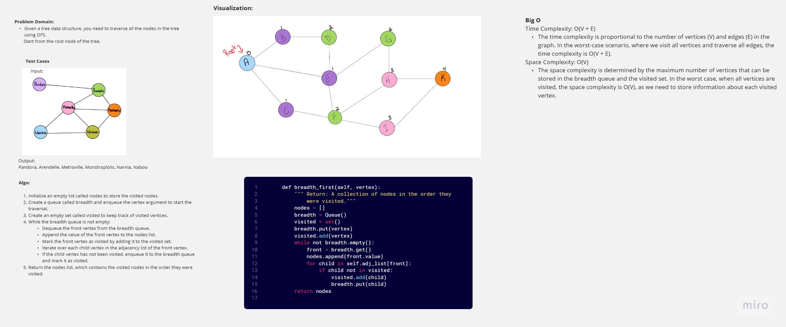

# Code Challenge: Class 36
Write the following method for the Graph class:

breadth first
Arguments: Node
Return: A collection of nodes in the order they were visited.
Display the collection

## Whiteboard Process
<!-- Embedded whiteboard image -->

## Approach & Efficiency
<!-- What approach did you take? Why? What is the Big O space/time for this approach? -->
Algorithm for breadth_first(vertex):
1. Initialize an empty list called `nodes` to store the visited nodes.
2. Create a queue called `breadth` and enqueue the `vertex` argument to start the traversal.
3. Create an empty set called `visited` to keep track of visited vertices.
4. While the `breadth` queue is not empty:
    5. Dequeue the front vertex from the `breadth` queue.
    6. Append the value of the front vertex to the `nodes` list.
    7. Mark the front vertex as visited by adding it to the `visited` set.
    8. Iterate over each child vertex in the adjacency list of the front vertex.
        - If the child vertex has not been visited:
            9. Enqueue the child vertex to the `breadth` queue.
            10. Mark the child vertex as visited by adding it to the `visited` set.
11. Return the `nodes` list, which contains the visited nodes in the order they were visited.

## Solution
<!-- Show how to run your code, and examples of it in action -->
```python
    def breadth_first(self, vertex):
        """ Return: A collection of nodes in the order they were visited."""
        nodes = []
        breadth = Queue()
        visited = set()
        breadth.put(vertex)
        visited.add(vertex)
        while not breadth.empty():
            front = breadth.get()
            nodes.append(front.value)
            for child in self.adj_list[front]:
                if child not in visited:
                    visited.add(child)
                    breadth.put(child)
        return nodes
```