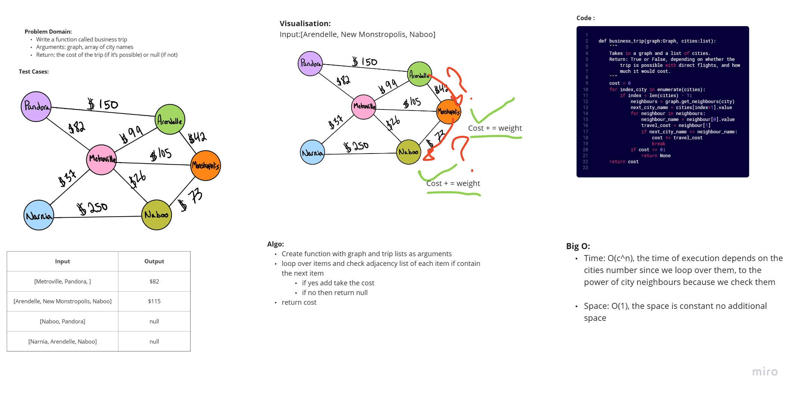

# Code Challenge: Class 37
Write a function called business trip
Arguments: graph, array of city names
Return: the cost of the trip (if it’s possible) or null (if not)
## Whiteboard Process
<!-- Embedded whiteboard image -->

## Approach & Efficiency
<!-- What approach did you take? Why? What is the Big O space/time for this approach? -->
#### Algo:
Create function with graph and trip lists as arguments
loop over items and check adjacency list of each item if contain the next item
if yes add take the cost
if no then return null
return cost
#### Big O:
- Time: O(c^n), the time of execution depends on the cities number since we loop over them, to the power of city neighbours because we check them

- Space: O(1), the space is constant no additional space
## Solution
<!-- Show how to run your code, and examples of it in action -->
```python
def business_trip(graph:Graph, cities:list):
    """
    Takes in a graph and a list of cities.
    Return: True or False, depending on whether the trip is possible with direct flights, and how much it would cost.
    """
    cost = 0
    for index,city in enumerate(cities):
        if index < len(cities) - 1:
            neighbours = graph.get_neighbours(city)
            next_city_name = cities[index+1].value
            for neighbour in neighbours:
                neighbour_name = neighbour[0].value
                travel_cost = neighbour[1]
                if next_city_name == neighbour_name:
                    cost += travel_cost
                    break
            if cost == 0:
                return None
    return cost
```