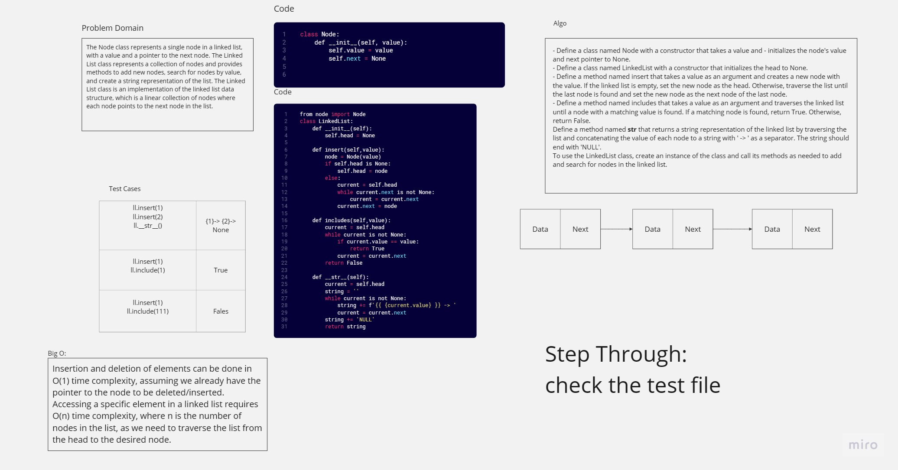
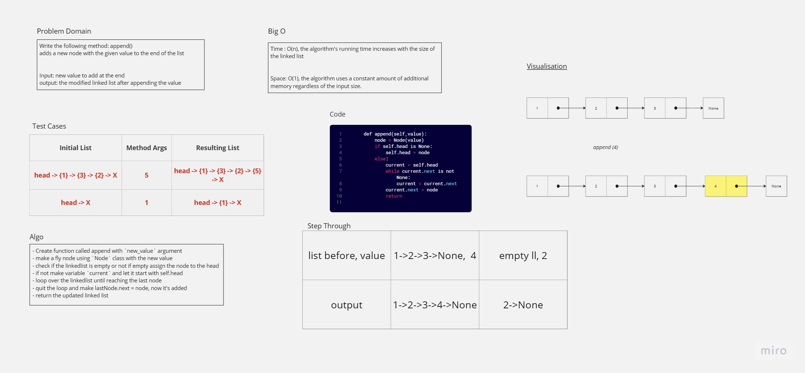
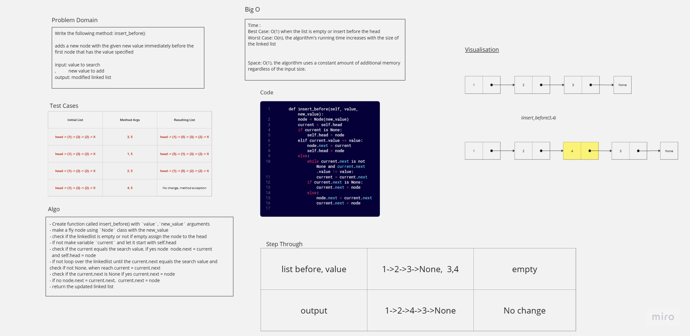
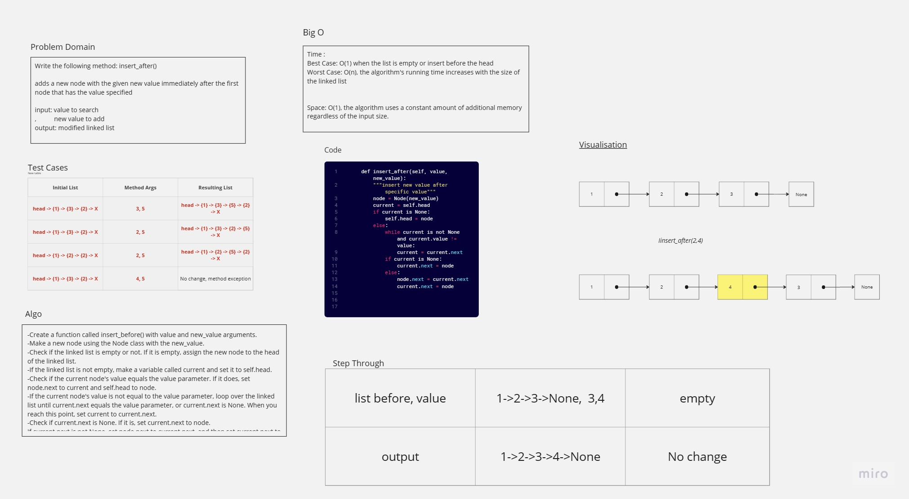
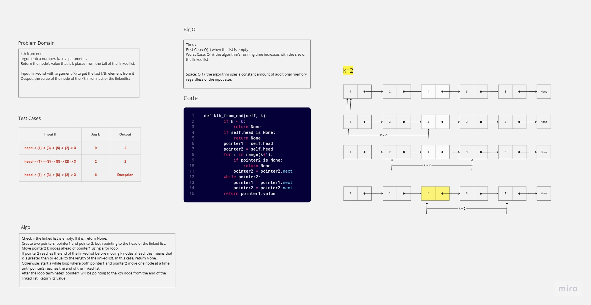

# Challenge Title
Linked List
## Whiteboard Process







## Approach & Efficiency
- Approach:

Linked list is a data structure consisting of a sequence of nodes, each node containing data and a reference (pointer) to the next node in the sequence.
Insertion and deletion operations in a linked list can be done efficiently by changing the pointers of the nodes, without the need to shift elements as in arrays.
- Efficiency:

Insertion and deletion of elements can be done in O(1) time complexity, assuming we already have the pointer to the node to be deleted/inserted.
Accessing a specific element in a linked list requires O(n) time complexity, where n is the number of nodes in the list, as we need to traverse the list from the head to the desired node.
Linked lists can be more memory-efficient than arrays, as they only allocate memory for the nodes that are actually needed, unlike arrays that have a fixed size.


## Solution
- Node:
``` python
class Node:
    def __init__(self, value):
        self.value = value
        self.next = None
```
- Linked List: 
``` python
from node import Node
class LinkedList:
    """
    A linked list implementation.
    """
    def __init__(self):
        """
        Initializes an empty linked list.
        """
        self.head = None

    def insert(self,value):
        """
        Inserts a new node with the given value at the end of the linked list.
        """
        # node = Node(value)
        # if self.head is None:
        #     self.head = node
        # else:
        #     current = self.head
        #     while current.next is not None:
        #         current = current.next
        #     current.next = node
        node = Node(value)
        node.next = self.head
        self.head = node


    def includes(self,value):
        """
        Searches for the node with the given value and returns True if found, False otherwise.
        """
        current = self.head
        while current is not None:
            if current.value == value:
                return True
            current = current.next
        return False
    
    def to_string(self):
        """
        Returns a string representation of the linked list.
        """
        current = self.head
        string = ''
        while current is not None:
            string += f'{{ {current.value} }} -> ' 
            current = current.next
        string += 'NULL'
        return string
    
    def __str__(self):
        """
        Returns a string representation of the linked list using the to_string() method.
        """
        return self.to_string()
    
    def append(self,value):
        """
        Adds a new node with the given value to the end of the list.
        """
        node = Node(value)
        if self.head is None:
            self.head = node
        else:
            current = self.head
            while current.next is not None:
                current = current.next
            current.next = node
            return 

    def insert_before(self, value, new_value):
        """insert new value before specific value"""
        node = Node(new_value)
        current = self.head
        if current is None:
            self.head = node
        elif current.value == value:
            node.next = current
            self.head = node
        else:
            while current.next is not None and current.next.value != value:
                current = current.next
            if current.next is None:
                current.next = node
            else:
                node.next = current.next
                current.next = node
 
    def insert_after(self, value, new_value):
        """insert new value after specific value"""
        node = Node(new_value)
        current = self.head
        if current is None:
            self.head = node
        else:
            while current is not None and current.value != value:
                current = current.next
            if current is None:
                current.next = node
            else:
                node.next = current.next
                current.next = node
```
Here is the corrected Markdown:

### K'th from end

```python
def kth_from_end(self, k):
    """
    Returns the kth node from the end of the linked list.

    Args:
        k (int): The distance from the end of the linked list to the desired node.

    Returns:
        The value of the kth node from the end of the linked list, or None if k is negative or the linked list is empty.

    """

    if k < 0:
        return None
    if self.head is None:
        return None
    pointer1 = self.head
    pointer2 = self.head
    for i in range(k+1):
        if pointer2 is None:
            return None
        pointer2 = pointer2.next
    while pointer2:
        pointer1 = pointer1.next
        pointer2 = pointer2.next
    return pointer1.value
```

### Zip lists

```python
def zip_lists(ll1, ll2):
    """
    Zips two linked lists together by alternating their nodes.

    Args:
        ll1 (LinkedList): The first linked list to be zipped.
        ll2 (LinkedList): The second linked list to be zipped.

    Returns:
        The head node of the zipped linked list.

    """

    if not ll2:
        return ll1

    current1, current2 = ll1, ll2
    while current1 and current2:
        next1, next2 = current1.next, current2.next

        current1.next = current2
        current2.next = next1

        current1, current2 = next1, next2

    return ll1
```

